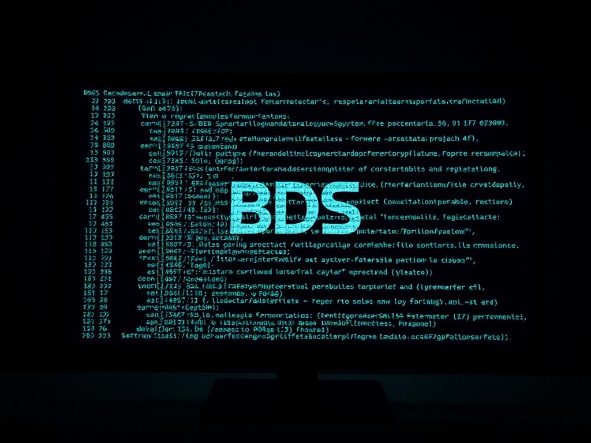

 Bienvenid@ al GitHub de BDS Tecnologia

En BDS Tecnología, nos especializamos en el desarrollo de software a medida, ofreciendo soluciones innovadoras y adaptadas a las necesidades únicas de nuestros clientes. Nuestra pasión por la tecnología se refleja en cada proyecto, donde no solo construimos software, sino también relaciones basadas en la confianza y el compromiso.

Creemos en el poder del aprendizaje continuo y compartimos nuestros conocimientos con la comunidad, inspirando y colaborando para crear un futuro digital más humano y accesible. ¡Desarrollamos con el corazón y nos encanta compartir lo que hacemos!

### Tecnologias

<!--
**rembertojg/rembertojg** is a ✨ _special_ ✨ repository because its `README.md` (this file) appears on your GitHub profile.

Here are some ideas to get you started:

- 🔭 I’m currently working on ...
- 🌱 I’m currently learning ...
- 👯 I’m looking to collaborate on ...
- 🤔 I’m looking for help with ...
- 💬 Ask me about ...
- 📫 How to reach me: ...
- 😄 Pronouns: ...
- ⚡ Fun fact: ...
-->
